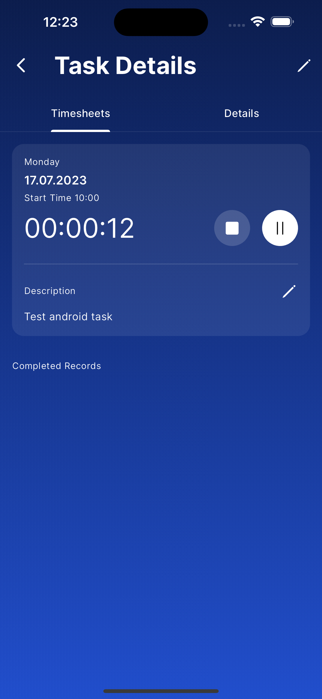

# Flutter timer app

A simple timer app built with Flutter.

|                            Empty Screen                             |                           Create Timer 1                            |                            Timer List                             |
| :-----------------------------------------------------------------: | :-----------------------------------------------------------------: | :---------------------------------------------------------------: |
|  |  |  |

|                            Timesheet                             |                            Completed Task 1                            |                            Task Details                             |
| :--------------------------------------------------------------: | :--------------------------------------------------------------------: | :-----------------------------------------------------------------: |
|  |  |  |
